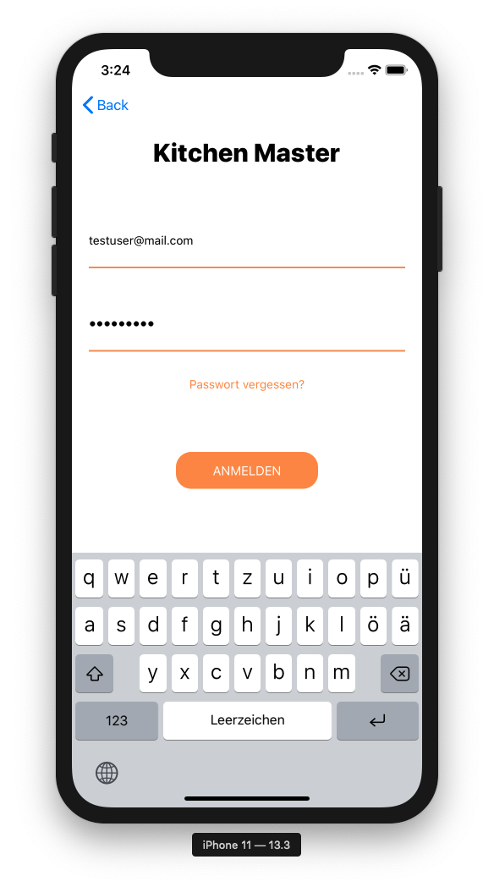
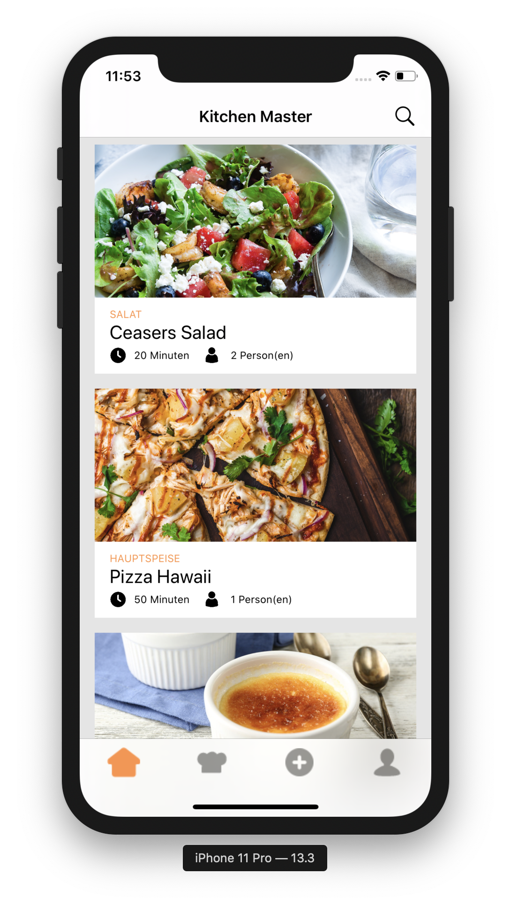
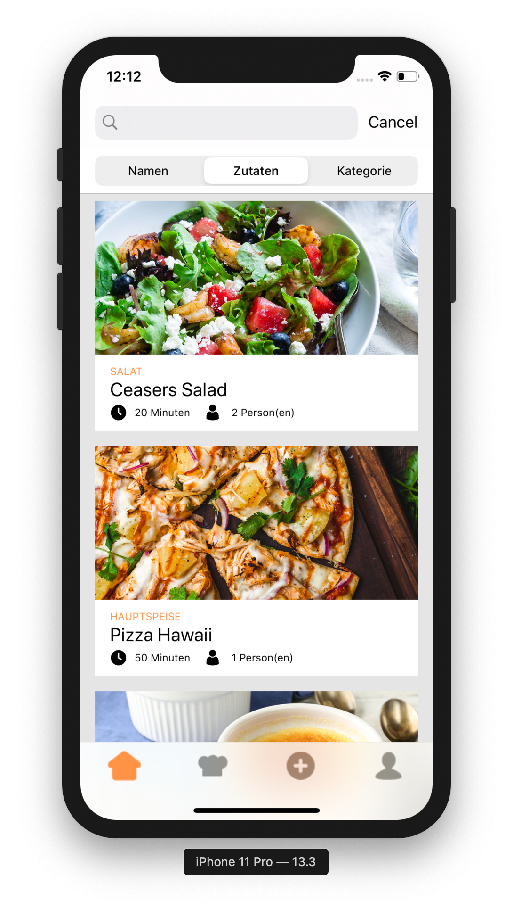

# kitchenMaster
This is one of my first iPhone applications. Its idea is to recommend recipes based on the ingredients you have at home.

# Architecture
To get a first idea of the application structure you can habe a look at the wireframe. You can find this file in the documentation folder. There are some more informations about the app (only in German).

## Coding and Data Base
kitchenMaster ist completely programmed using Swift. Currently you can save recipes on the local Storage with pList as a Dictionary. There is also a user login and register function that is connected to the Google Data-Base service "Firebase"

## Images

  
  
  

## Features 1st stage
* Searching for recipes based on ingrediants
* Searching for recipes based on name
* Adding recipes

## Optional features 2nd stage
* Database
* User Login
